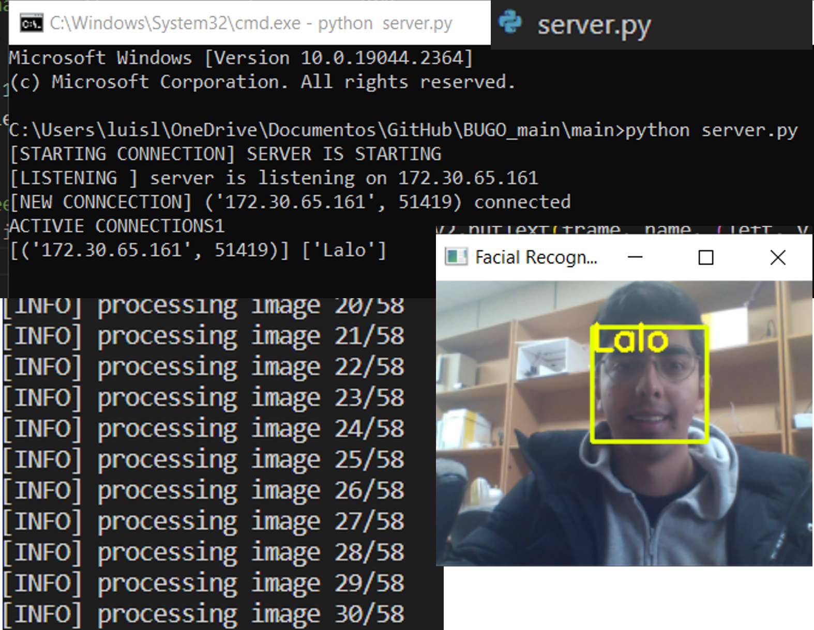

# BUGO_main

Scenario
요즘 마케팅의 발달로 무인점이라는 새로운 유형의 매장이 등장했으며, 이러한 추세는 국내에서도 무인으로 운영되는 매장이 늘어나는 결과를 낳고 있습니다.

문제점
무인 매장의 경우, 상품 품절 시 즉각적인 대응이 어렵고, 고객의 구매 패턴을 정확히 파악하기 어려워 마케팅 전략 수립에 어려움을 겪을 수 있습니다.

**제안 시스템**

**상품의 QR코드 생성**
QRCODE.py

상품의 QR코드 생성
**Data Collection**
headshots.py

데이커 모으기. 

**Training**
train_model.py

모델 학습 시킵니다

**Getting Info from Client to Server**
facial_req.py & server.py

서버에서는 고객 인식합니다.

**Read Product's QR code**
READQRCODE2.py

클라이언트에서 QR코드 인식 확인 할 수 있습니다.

**Purchase Info Displayed on Server**
server.py

서버에서 상풍의 정보를 받고 DB 처리합니다.